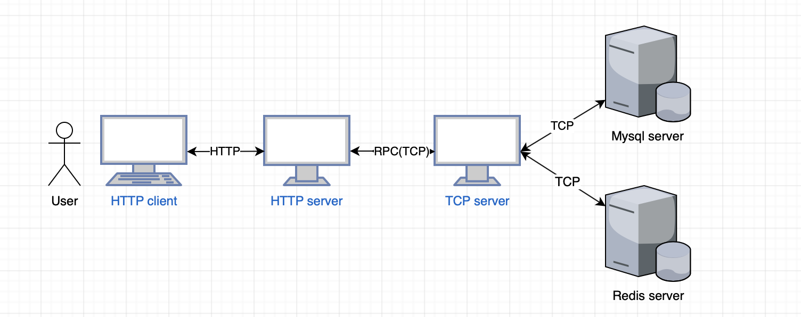
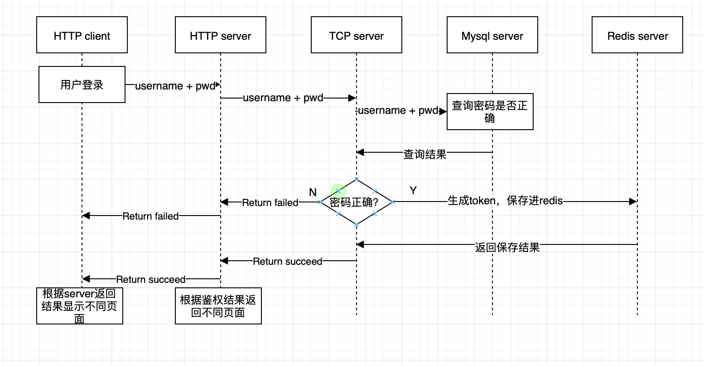
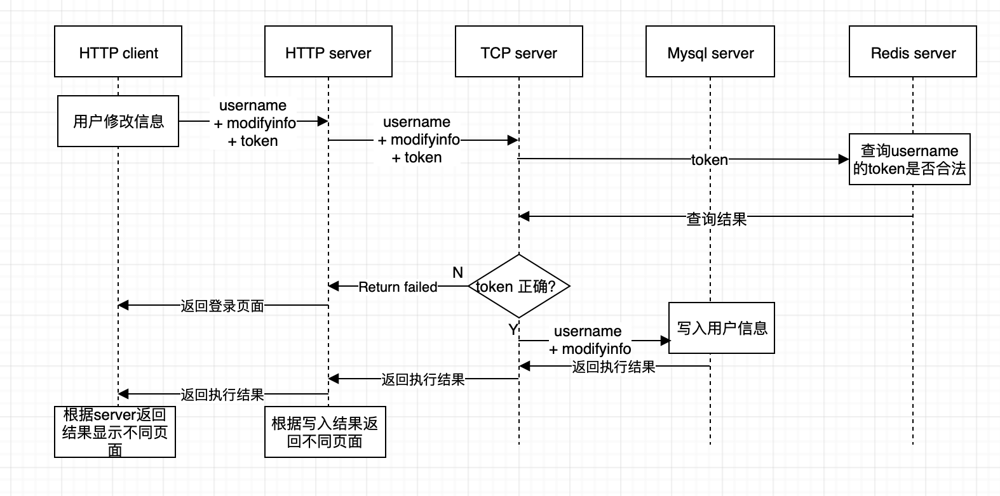

#设计文档
本文档为总体的是设计文档，具体包括

* 架构设计
* 详细设计
	1.	用户登录
	2. 用户信息修改

##架构设计

*	http server对用户从http client输入的数据进行基本处理，并将过滤后的数据发送到tcp server进行处理
*  http server与tcp server之间的通信使用RPC通信，该项目中的RPC基于TCP协议设计，数据的序列号使用了二进制和SON
*  tcp server完成最终与mysql或者redis的数据库操作，并将处理结果向上返回
*  tcp server通过go携程处理数据并发

##详细设计

###用户登录

*	用户登录时需要处理
	1.	用户名和密码对应关系的校验，通过查询mysql中的用户信息的到校验结果
	2. 登录成功后生成该用户的token，通过写入redis保存username
和token的对应关系

###修改用户信息

*	可修改的用户信息包括用户昵称和用户头像，在图中统一用modifyinfo表示
* 	用户只有在登录后才可以进行头像和昵称的修改，因此在修改用户信息时需要将用户的token发送到http server，http server会将数据发送到tcp server，最终由tcp server调用redis校验用户token是否合法
*  如果用户信息修改成功，则会返回用户信息界面，显示用户新修改后的个人数据；如果修改失败(token问题导致)，则会返回登录界面提示用户重新登录